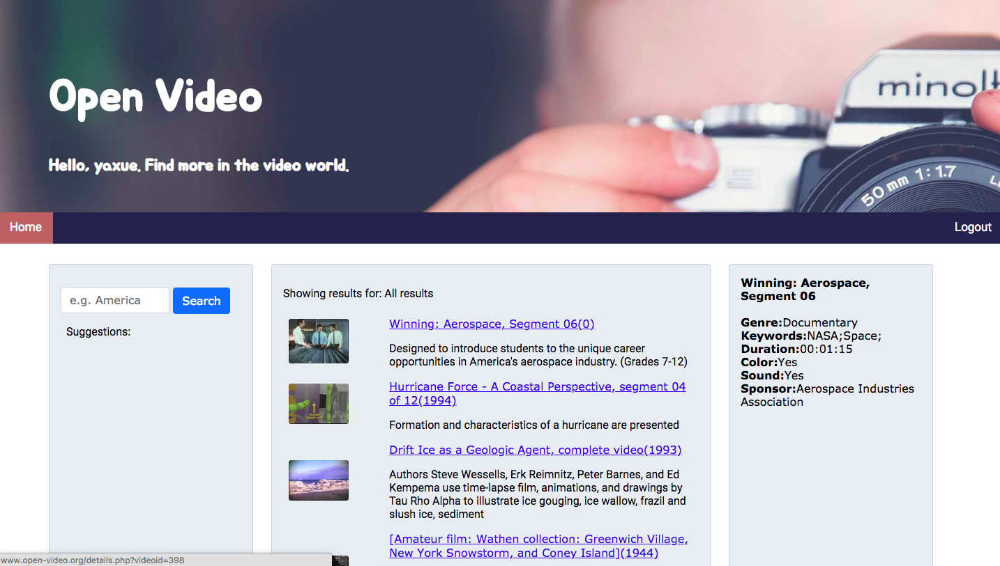
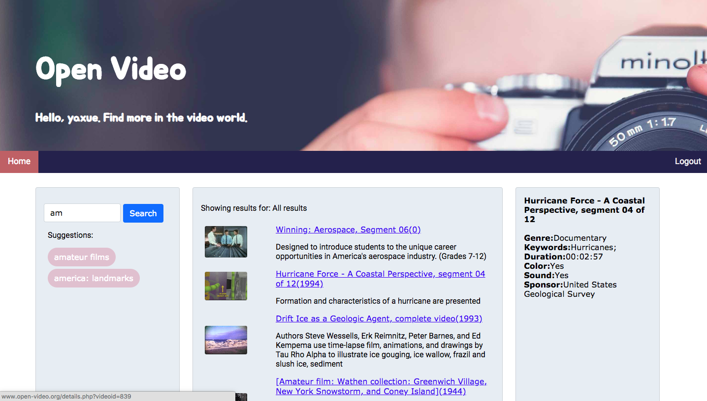
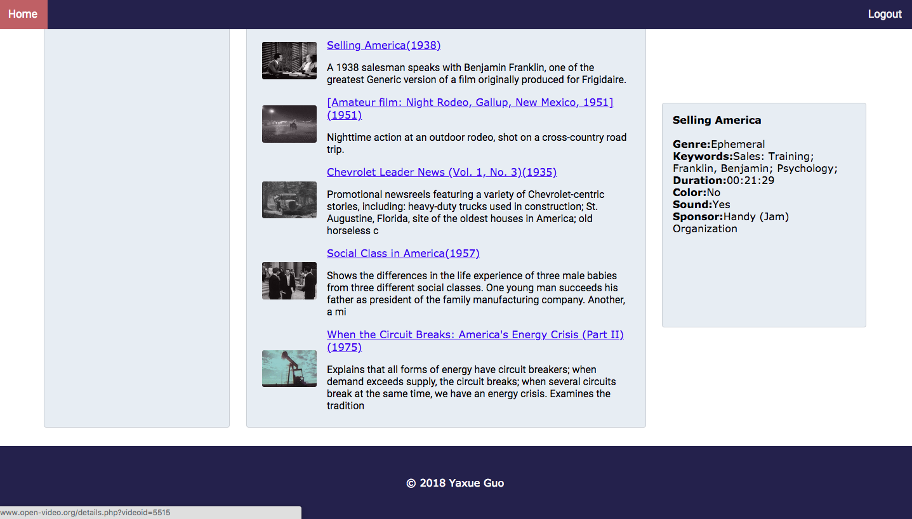

# Open Video Search Web Application 📼

This is a video search web application that implemented full-text search capabilities for 198 open videos data stored in the MySQL database. *jQuery + AJAX* were used to implement the "search suggestion" interface and mouse-over feature to display video details. Login requested before use.
[Click to launch the website](http://www.yaxueguo.com/openvideo/login.php).

## Technology Stack
 
AJAX, JQuery, PHP, MySQL, HTML5, CSS3, Bootstrap.

## Get Started

 > You may find the *AJAX* functions (hover and show details, auto-suggestion) respond slowly, even showing *ERR_CONNECTION_TIMED_OUT*, and this issue is due to the server service. 

 * Log in. Use **yaxue** as username and **ov2018** as password.


 * Hover on one record to see details on its right side, including its genre, keywords, duration, color, sound and sponsor.



    
 * Input what you are interested in into the search area and an auto-suggestion function will be triggered as you input character by character or delete. 
 
```
  $("#inputVal").keyup(function () {
                // when typing in the search-box character by character.
                // send characters typed so far through GET parameter to php.
                $.get("keyword-suggestions.php?input=" + $("#inputVal").val(),
                    function (data, status) {
                        // display query suggestion results to #l2 div
                        $("#l2").html(data)
                    })
            });
            
  // sanitize user input by addslashes to prevent MySQL injection
  // only select maximum of 10 suggested words using LIKE
  $query_search = "SELECT * FROM p2suggestion WHERE word LIKE '" 
                    . addslashes($_GET['input']) . "%' LIMIT 10";
  if ($result = $mysqli->query($query_search)) {
      while ($row = $result->fetch_assoc()) {
          // display each record of word with style
          echo "<a class='sg'>" . $row['word'] . "</a><br>";
      }
  }
```


    
* The search result of input "america". Detail on the right is fixed as user scrolls down the page.


    
 * Click log out button on the right of the menu bar to log out.


    
## Author

 * **Yaxue Guo** independently designed and developed this application.

## Acknowledgement

 * The 198 sample records used in this project is credit to [The Open Video Project](https://open-video.org/) from **Interaction Design Laboratory** at [The School of Library and Information Science, University of North Carolina at Chapel Hill](https://sils.unc.edu/).